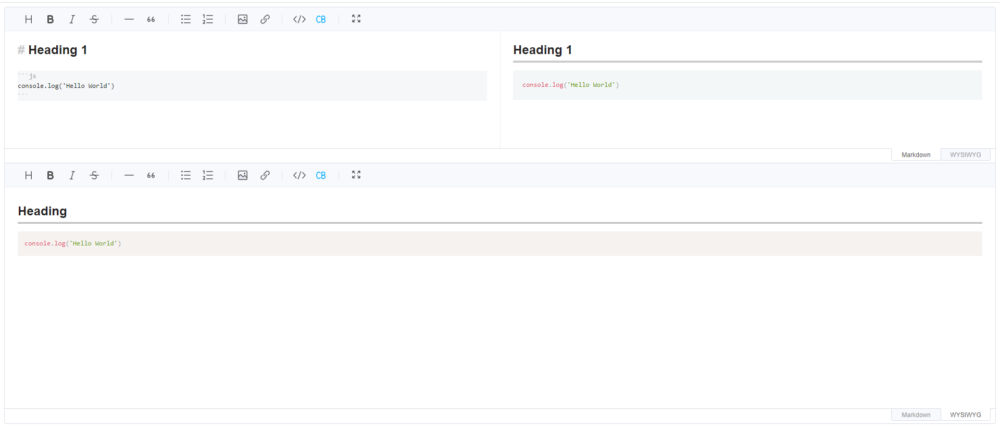

# Toast UI Editor

## Preview


## Document

- https://www.npmjs.com/package/@toast-ui/editor

## Dependencies

```
npm i @toast-ui/editor @toast-ui/editor-plugin-code-syntax-highlight prismjs
```

## Usage

```html
 <body>
    <div id="editor"></div>
    <div id="editor2"></div>
    <script type="module" src="/main.js"></script>
</body>
```

```js
// main.js
import { TextEditor } from './TextEditor.js';

new TextEditor({
    el:document.querySelector("#editor"),
    placeholder: 'Please enter text 1'
});

new TextEditor({
    el:document.querySelector("#editor2"),
    height: '500px',
    placeholder: 'Please enter text 2'
});
```

```js
//TextEditor.js
import "./fullscreen.css";
import "@toast-ui/editor/dist/toastui-editor.css";
import "prismjs/themes/prism.css";
import Editor from "@toast-ui/editor";
import codeSyntaxHighlight from "@toast-ui/editor-plugin-code-syntax-highlight/dist/toastui-editor-plugin-code-syntax-highlight-all.js";

export class TextEditor {
    ...
}
```

```css
/*fullscreen.css*/
.body {
    position: relative;
    padding: 0;
    margin: 0;
    overflow: hidden;
}
.fullscreen {
    position: absolute;
    width: 100%;
    height: 100vh;
    padding: 0;
    margin: 0;
    top: 0;
    left: 0;
    z-index: 3000;
}
.fullscreen .toastui-editor-defaultUI {
border-radius: 0;
}
.fullscreen .toastui-editor-defaultUI-toolbar {
border-radius: 0;
}
```